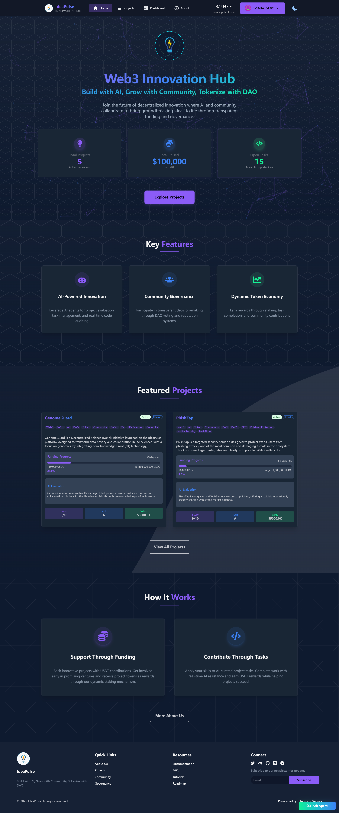

# 🚀 IdeaPulse

> Build with AI, Grow with Community, Tokenize with DAO

A Web3 innovation incubation platform based on pre-issuance token crowdfunding and community DAO governance, enabling AI and token holders to jointly support project idea incubation, development, and implementation.

<div align="center">
  
</div>

## 📋 Project Overview

### Vision and Core Values

IdeaPulse is committed to breaking the centralized monopoly of traditional VCs, exploring new paths for innovative projects through community-driven, fully transparent processes. We're building a "Product Hunt+DAO" model where:

- **Co-creating an Equal Community**: Anyone can participate equally in project building, with trusted AI Agents distributing rewards based on contributions
- **Blockchain Ecosystem Support**: Projects in different blockchain ecosystems increase transaction volume and bring innovation
- **Customized Agent Services**: Different AI Agents for each public chain provide tailored solutions
- **Work Paradigm Innovation**: A revolutionary DAO allowing participants to maximize value in projects they're passionate about

### Core Project Objectives

- **Social Creative Entry Point**: Submit ideas by @AI Agent (Farcaster/Twitter), with AI generating structured proposals
- **Dynamic Staking Crowdfunding**: Stake project tokens to join development, unlock stakes after task completion
- **Project Token Economic Design**: AI Agent reserves 15-30% of tokens for ecosystem building
- **Pre-issuance Token Crowdfunding**: Fund projects at the no-product stage through AI-generated prototypes
- **AI+Community Co-governance**: Token holders and AI Agents jointly participate in voting decisions
- **Anti-VC Centralization Design**: Ensuring open and transparent decision-making processes
- **SocialFi Integration**: Building a vibrant community through social media channels

## 🔍 Core Problems Solved

1. **Preventing Post-Token Issuance Stagnation**
   - Dynamic staking mechanism ensures continuous development
   - Pre-issuance token crowdfunding with clear fund usage
   - AI+Community co-governance maintains development momentum

2. **Increasing Participation Opportunities**
   - Low barrier idea submission through AI agents
   - Task staking mechanism for deep community involvement
   - Economic incentives for active governance participants

3. **Empowering Communities Through Tokens**
   - Multi-level token ecosystem with governance rights
   - Token reservation for long-term ecosystem building
   - SocialFi integration enhancing community engagement

4. **Solving Centralization and Transparency Issues**
   - Open fund allocation and governance processes
   - AI-assisted decision-making enhancing decentralization

5. **Lowering Entry Barriers for New Projects**
   - Support for projects at the idea stage
   - Token staking system for development funding

6. **Improving Project Management Efficiency**
   - AI for idea generation, proposal structuring, and task auditing
   - Automated qualification verification and milestone tracking

## 🔄 Project Flowchart


## 🛣️ Development Roadmap

### Phase 1: AI Collaborative Creation
- **M1: AI Core Protocol**
  - Natural language processing for project proposal generation
  - Technical solution feasibility analysis
- **M2: Dynamic Staking Crowdfunding**
  - Project token fundraising
  - Smart contract fund locking
- **M3: Task Market 1.0**
  - Automated task publishing
  - Tokenized reward distribution
  - Social media bot integration

### Phase 2: Community Governance
- **M4: Decentralized Forum**
  - Proposal discussion protocols
  - Agent participation in discussions
  - Snapshot voting integration
- **M5: Project Self-governance Protocol**
  - Independent AI Agents for each project
  - Agent management dashboard
- **M6: Governance Mechanism 1.0**
  - Task qualification review
  - Dynamic staking voting
  - Anti-fraud detection
  - Basic reputation system

### Phase 3: Token Economy Deepening
- **M7: Proposal-Driven Development**
  - Community proposals → automated tasks
  - Dual-token staking pools
  - Customized reward distribution
- **M8: Token Economic Model**
  - Yield aggregators
  - Cross-project token swap protocols
  - Token leverage staking
- **M9: SocialFi Integration**
  - Social media progress synchronization
  - Governance data visualization

### Phase 4: Ecosystem Optimization
- **M10: Multi-chain Collaboration Protocol**
  - Cross-chain communication via LayerZero
  - Multi-chain collaborative development
  - Cross-chain token exchange gateway
- **M11: Governance Mechanism 2.0**
  - AI+Community dual voting
  - Reputation-weighted system with POAP integration
  - Governance-development automation
- **M12: Ecosystem Optimization**
  - AI effect evaluation
  - Multi-language promotion generator
  - On-chain ecosystem auditing

## 🛠️ Technical Stack

Built using:
- **Smart Contracts**: Solidity, ERC-2535 Diamond Standard
- **Development Framework**: Foundry
- **Frontend**: Next.js 14.2.x App Router
- **Web3 Integration**: Wagmi 2.12.x, Viem 2.21.x
- **Authentication**: RainbowKit with SIWE

## 🚀 Getting Started

### Requirements

Before you begin, you need to install the following tools:

- [Node (>= v18.18)](https://nodejs.org/en/download/)
- Yarn ([v1](https://classic.yarnpkg.com/en/docs/install/) or [v2+](https://yarnpkg.com/getting-started/install))
- [Git](https://git-scm.com/downloads)

### Quick Start

1. Install dependencies:
```bash
yarn install
```

2. Run a local network:
```bash
yarn chain
```

3. Deploy the test contract:
```bash
yarn deploy
```

4. Start your NextJS app:
```bash
yarn start
```

Visit your app on: `http://localhost:3000`

## 🤝 Contributing

We welcome contributions to IdeaPulse! Please see [CONTRIBUTING.MD](https://github.com/scaffold-eth/scaffold-eth-2/blob/main/CONTRIBUTING.md) for more information and guidelines.

## 📄 License

IdeaPulse is licensed under [MIT License](LICENSE).