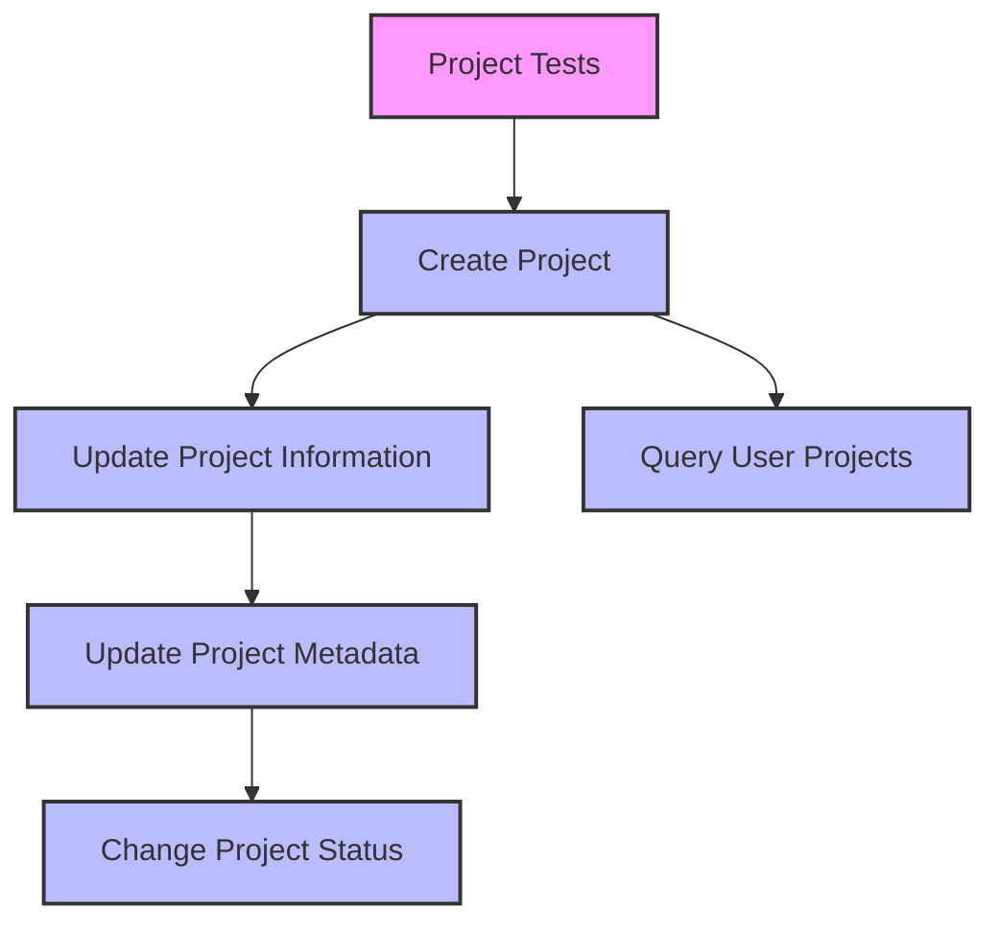
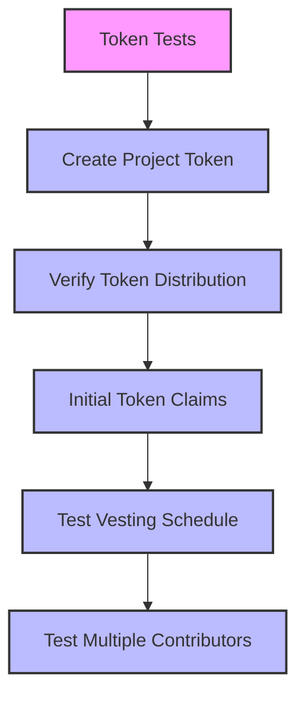
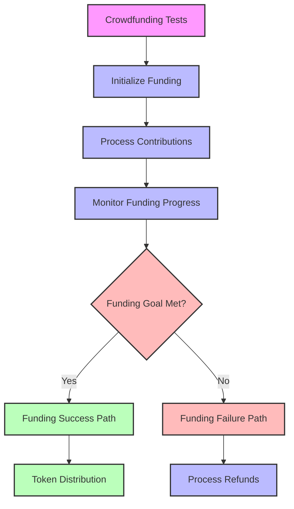
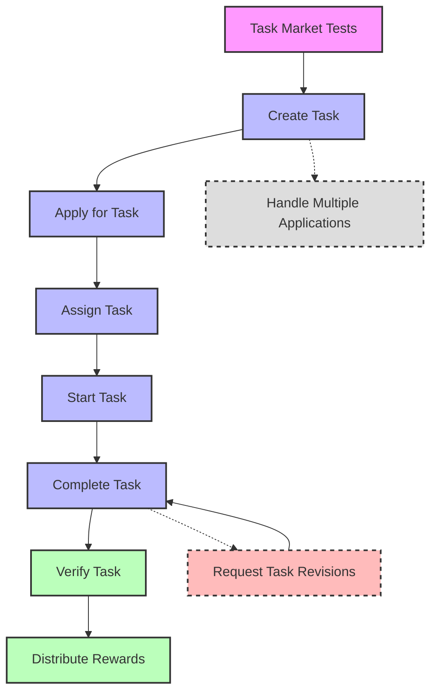
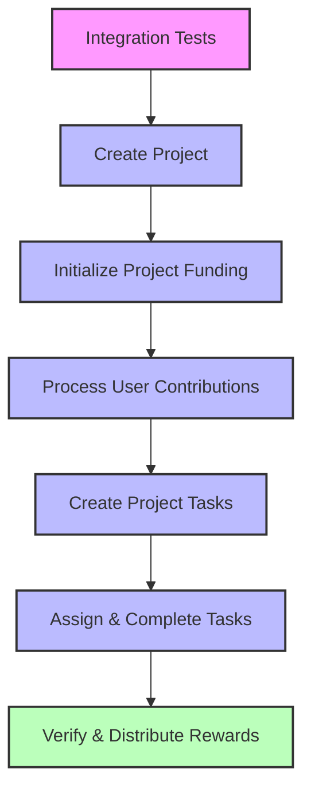

# Test Workflow Documentation

This document outlines the test workflows for different components of the IdeaPulse protocol.

## Project Lifecycle Tests

## Token Distribution Tests

## Crowdfunding Functionality Tests

## Task Market Tests

## Integration Test Workflow

## Legend

- 🟣 Test Suite Entry Point
- 🔵 Standard Test Steps
- 🔴 Error/Failure Cases
- 🟢 Success/Completion Steps
- ⚪ Optional/Alternative Flows

## Test Flow Recommendations

1. **Unit Testing First**: Start with unit tests for each facet independently
2. **Mock Dependencies**: Use mock implementations for dependencies when testing individual facets
3. **Integration Testing**: After unit tests pass, proceed to integration testing
4. **Fuzz Testing**: For critical functions, implement fuzz testing with various inputs
5. **Edge Cases**: Ensure all edge cases are covered, especially for financial operations
6. **Gas Optimization**: Include gas usage tests to monitor contract efficiency