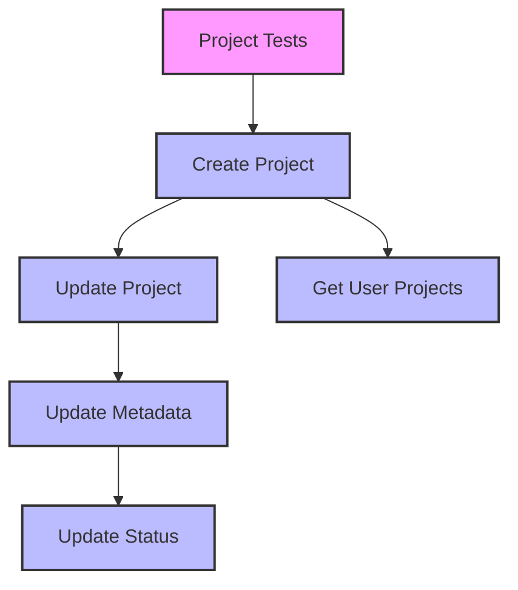
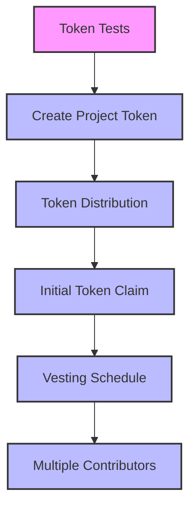
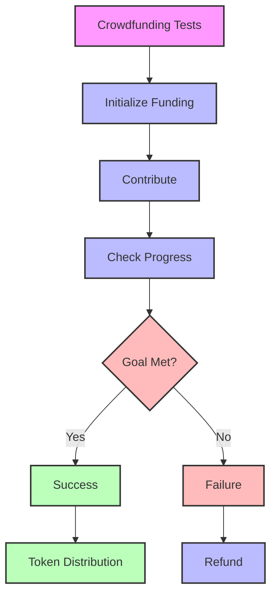
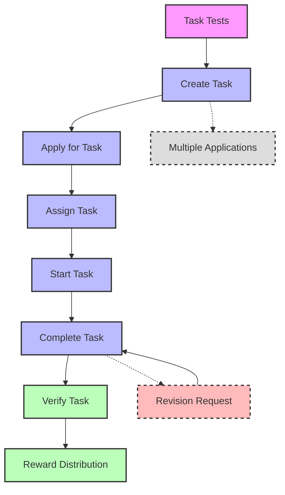
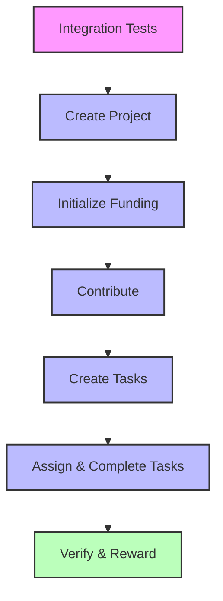

# Test Workflow Diagrams

## Project Tests Workflow

## Token Tests Workflow

## Crowdfunding Tests Workflow

## Task Market Tests Workflow

## Integration Test Flow

Colors Legend:
- 🟣 Test Suite Entry Point
- 🔵 Standard Test Steps
- 🔴 Error/Failure Cases
- 🟢 Success/Completion Steps
- ⚪ Optional/Alternative Flows